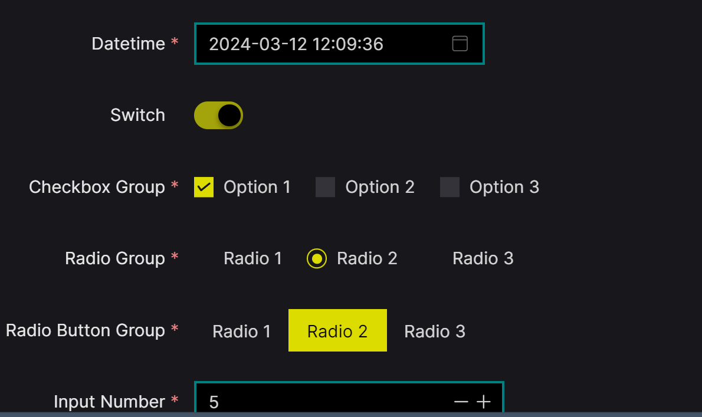

```shell script
pnpm i y-naive-dark-theme
```
```vue
<template>
	<n-config-provider :theme-overrides="override">
		<app/>
	</n-config-provider>
</template>
<script lang="ts" setup>
import override from "naive-dark-theme/naive";
</script>
```
